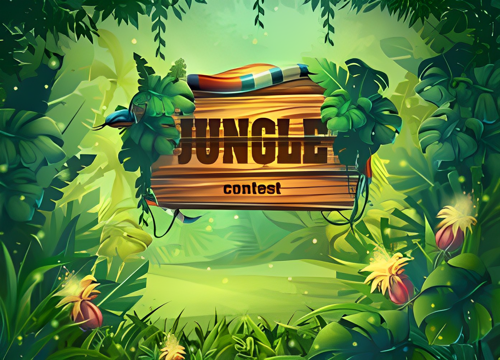

# 🐍 Snake Game

A classic Snake Game implemented in HTML, CSS, and JavaScript.



## 👋 Introduction

Welcome to the Snake Game! This project is a simple implementation of the classic Snake Game using web technologies - HTML, CSS, and JavaScript.

## ✨ Features

- Responsive design, playable on various devices.
- Simple and intuitive controls.
- Local storage to track and display high scores.
- Game over pop-up with a retry button.
- Background image customization.

## 🎮 How to Play

1. **Clone or download the repository to your local machine.**
2. **Open the `index.html` file in a web browser.**
3. **Click the "Start" button to begin the game.**
4. **Use arrow keys or on-screen controls to control the snake.**
5. **Collect the red squares (food) to grow the snake and increase your score.**
6. **Avoid collisions with the walls and the snake's own body.**
7. **The game ends when the snake collides with the walls or itself.**
8. **A pop-up message will appear with the option to retry the game.**

## 🎮 Game Controls

- **Arrow Up:** Move Up
- **Arrow Down:** Move Down
- **Arrow Left:** Move Left
- **Arrow Right:** Move Right

On-screen controls are also available for touch devices.

## 🎉 Demo

[Live Demo](#) - https://dimuthnilanjana.github.io/snakegame_js/

## 🚀 Installation

Clone the repository to your local machine using the following command:

```bash
git clone https:https://github.com/Dimuthnilanjana/snakegame_js.git


